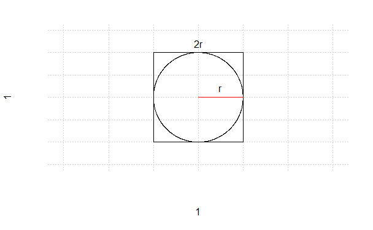
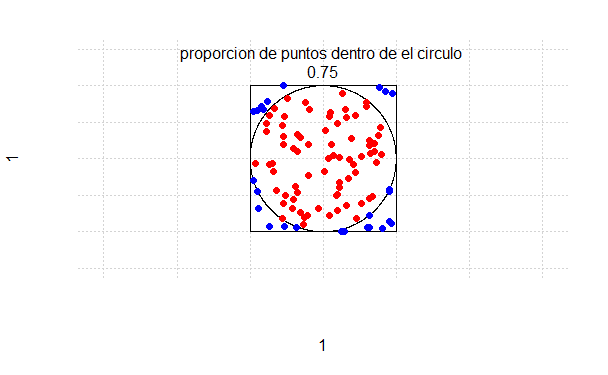
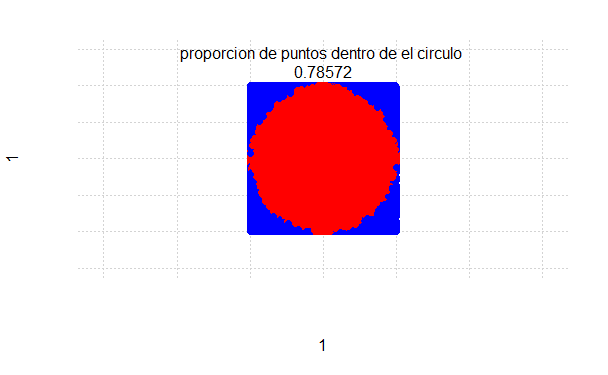

# Aproximacion del Numero pi

## Introduccion

Entre tantas maneras que se ha aproximado el famoso numero π, hoy se aproximara con probabilidades.
Veamos lo siguiente, se tiene un circulo de radio r circunscrito a un cuadrado de lado 2r, como se ilustra
acontinuacion.

Ahora, con la idea de aproximar al valor del numero π, nos apoyaremos en probabilidades, en este caso, se
determinara la probabilidad de que un punto albergado aleatoriamente dentro del cuadrado este dentro del
circulo, Suponga que A es el evento que define ‘el punto esta dentro del circulo’, con lo cual la probabilidad
teorica es el area del circulo dividido el area del cuadrado, asi:

en otras palabras tenemos que , significa que 4 veces la
probabilidad de que un punto aleatorio caiga dentro del circulo es equivalente al numero π.

De lo anterior podemos concluir que si logramos tener el valor de la probabilidad P(A), podremos obtener el valor de π, con lo cual,
podemos aproximar la probabilidad por simulacion, y asi aproximarnos al valor de π.

Suponga que con un software, garantizamos que se pintan aleatoriamente 100 puntos en el cuadrado, como se observa:

en este caso el 83% de los puntos caen dentro del circulo, con lo que una estimacion para π seria, 4(0.83)=3.32, por supuesto es
un acercamiento lejano del valor que esperamos, esto se debe a que solo utilizamos 100 puntos para aproximar la probabilidad.

Intentemoslo con un valor mas grande de puntos, por ejemplo 100.000 puntos:

Note que la proporcion ahora es 0.78712, con lo que 4(0.78712)=3.14848, algo mas cercano al valor de π.

si repetimos esto indefinidamente con grandes cantidades de puntos, podriamos promediar estas probabilidades, y ser aun mas certeros.

por ejemplo, si repetimos esto 10.000 veces, donde en cada ocacion consideramos 100.000 puntos, tendremos como estimacion del valor de 
π a  3.141585, con que es un buen acercamiento de estimacion al valor verdadero π.
